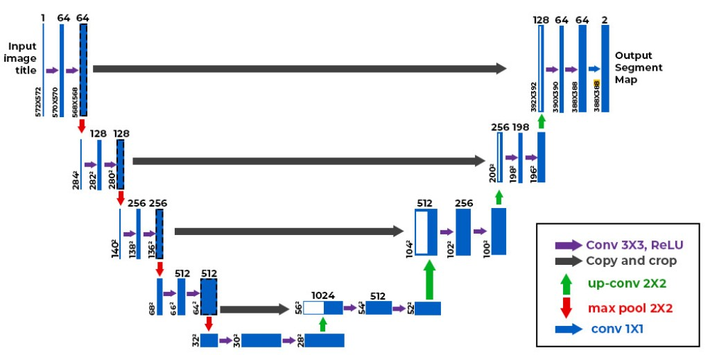
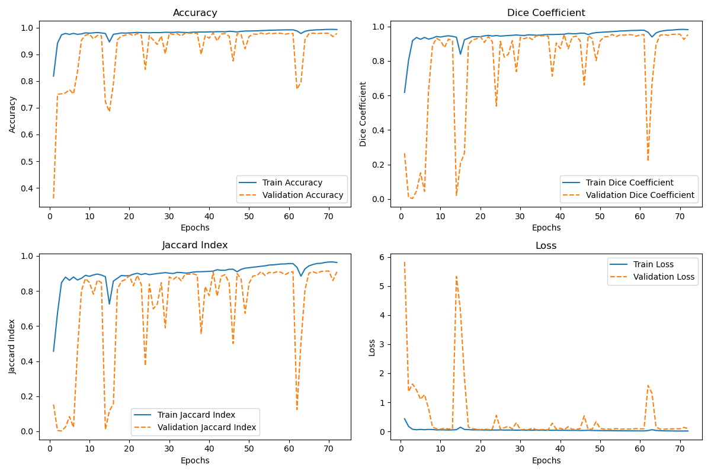

# Lung Segmentation Using U-Net

This repository contains a deep learning model for lung segmentation from chest X-ray images. The model is built using the U-Net architecture and trained on a dataset of chest X-ray images with corresponding lung masks.

## Dataset

The dataset used for training and testing can be found on Kaggle:  
[Chest X-Ray Lungs Segmentation Dataset](https://www.kaggle.com/datasets/iamtapendu/chest-x-ray-lungs-segmentation)

It includes:
- Chest X-ray images as input.
- Corresponding lung segmentation masks as ground truth.

<!-- ## Model Architecture

The model is based on the **U-Net architecture**, a popular convolutional neural network designed for biomedical image segmentation.

**Model architecture:**  

## Training Details

- **Framework:** TensorFlow/Keras  
- **Training Platform:** Google Colab (T4 GPU)  
- **Epochs:** 75  
- **Optimizer:** Adam  
- **Loss Function:** Binary Crossentropy  
- **Metrics:**
  - Accuracy
  - Dice Coefficient
  - Jaccard Index

**Training Metrics:**  
The training and validation performance metrics are visualized in the following plot:  
# 

## Results

The final metrics for the trained model are as follows:

- **Training:**
  - Accuracy: `0.9935`
  - Dice Coefficient: `0.9823`
  - Jaccard Index: `0.9653`
  - Loss: `0.0145`
- **Validation:**
  - Accuracy: `0.9790`
  - Dice Coefficient: `0.9549`
  - Jaccard Index: `0.9138`
  - Loss: `0.0920`

 -->

